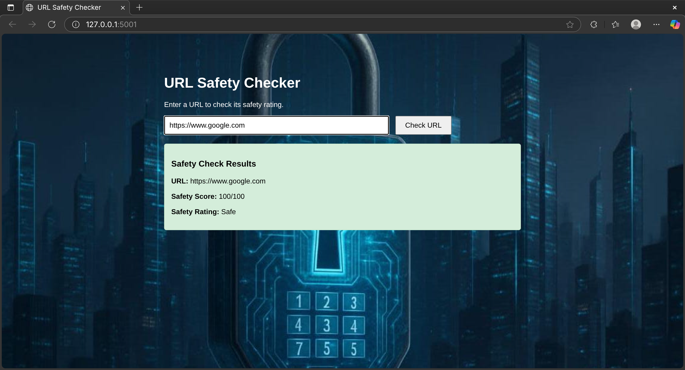
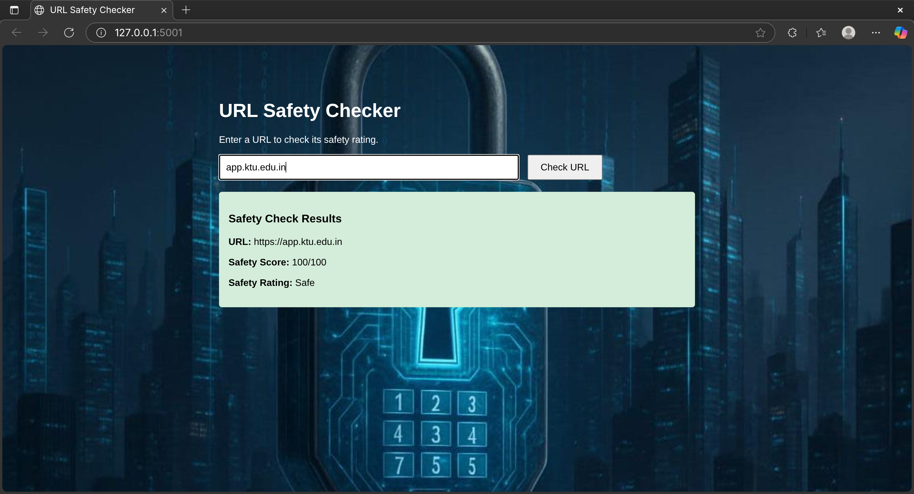
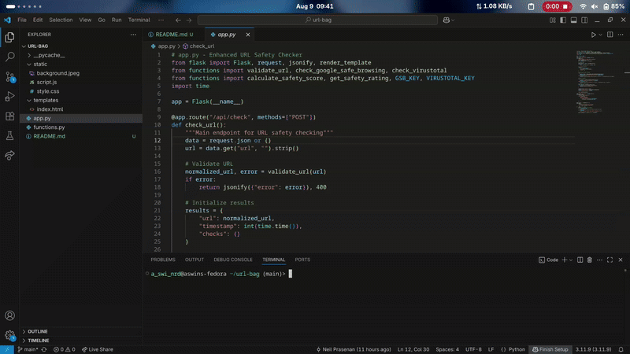

# URL BAG 🎯

## Basic Details
### Team Name: Segmentation fault

### Team Members
- Team Lead: Neil Prasenan - College of Engineering and Management punnapra
- Member 2: Aswin P  - College of Engineering and Management punnapra

### Project Description
The URL safety checker is a web application that accesses the safety of URLs by leveraging the Google safe Browsing and VirusTotal APIs.it validates URLs,checks them against known threats,and provide a safety score and detailed threat reports,ensuring users can make informed decisions while browsing online.

### The Problem (that doesn't exist)
 The Enhanced URL Safety Checker helps users identify harmful URLs that could lead to phishing attacks or malware infections, enhancing online security. By providing real-time assessments and detailed threat information, it empowers individuals and organizations to make safer decisions while browsing the internet.

### The Solution (that nobody asked for)
 By providing features like  URL validation,API Integration,Real-Time Thread Assessment,User friendly interface,Informed Decision Making. 

## Technical Details
### Technologies/Components Used
For Software:
- [Languages used python,css,html,javascript]
- [Frameworks used flask]
- [modules used: time, os, requests, re]

# Installation
sudo apt install python3
git clone https://github.com/BATMAN6666-007/url-bag

# Run
python3 app.py
aswinrd.pythonanywhere.com

# Screenshots (Add at least 3)

### Project Demo
# Video

## Team Contributions
- Neil Prasanen: Backend Python data processing logic development
- Aswin P: Frontend HTML, CSS, JS

---
Made with ❤️ at TinkerHub Useless Projects 

